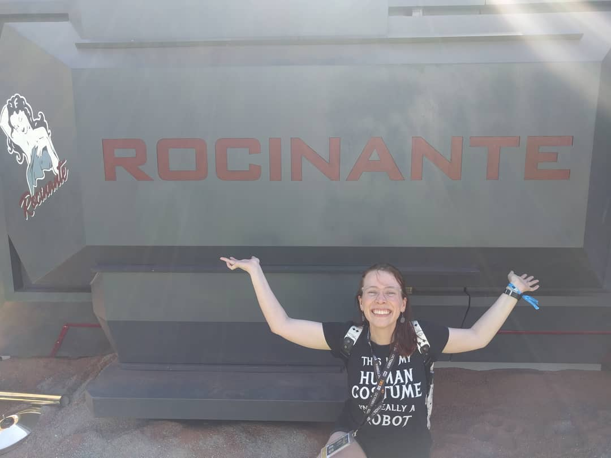

## About Me

+ __Name:__ Lisa 
+ __Ocupation:__ Product Engineer
+ __Hobbies:__ Coffee, puzzles, games, hiking, building things, the hurdy gurdy

Hello there! You must be pretty awesome if you are checking out my humble website. Welcome! 

Currently my passion is wrangling across challenging datasets to find insights. Fortunately that is my focus in my current role where I investigate manufacturing yield performance and find opportunities for improvement. 

In my spare time I enjoy working on my various R based projects, building things, and talking about anything SciFi. 

My resume is available [here](files/Anders_resume_2020V1.pdf)

<!-- http://leesahanders.github.io -->

<!-- rmarkdown::render_site(encoding = "UTF-8") -->

Rmarkdown resources: 

 - https://github.com/privefl/rmarkdown-website-template 

