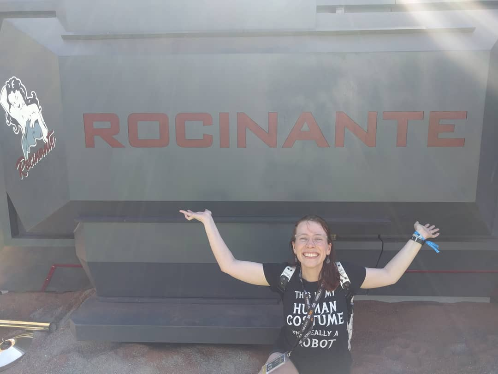

Hello there! You must be pretty awesome if you are checking out my humble website. Welcome! 

Currently my passion is wrangling across challenging datasets to find insights. Fortunately that is my focus in my current role where I investigate manufacturing yield performance and find opportunities for improvement. 

I started out my career 9 years ago as a research assistant at Virginia Tech in the Biomechanical Systems Laboratory where I performed product design, manufacturing, and characterization.My favorite projectwas setting up a cheap photolithography station using a chemical which allowed us to move our research outside of the clean room and made for a faster prototyping cycle. It was really fun making a very technologically capable setup and testing it! I also acted as the technical expert for electrical safety. 

My next opportunitity was spending 3 years at Texas Instruments in a manufacturing rotation program where I rotated through semiconductor manufacturing, test and assembly, and research and development groups. I learned that I'm happiest working on projects with urgency, such as when working with manufacturing teams, where you can really make a difference and see the impact of your work. That is also where I developed my enthusiasm for Statistical Process Controls - seriously they will save your life!

The next transition was to Tronics MEMS, a small foundy, where I worked doing Product Integration. This was an extraordinary experience and while the projects were limited in scope and didn't make it to consumers I was really fortunate to work with that amazing team. 

Finally that brings me to my current role at Illumina where I am a Product Engineer. 

My resume is available [here](files/Anders_resume_2020V1.pdf)
