

 

## Adventures {.tabset}

### Big Sur - July 2020

“On soft Spring nights I'll stand in the yard under the stars - Something good will come out of all things yet - And it will be golden and eternal just like that - There's no need to say another word.” -Big Sur by Jack Kerouac

“Woke up today surrounded by nature, and laughed in the face of the swarm of mosquitoes. Total cost for dispersed camping: priceless (by which I mean free, national forests are awesome). Really need to do something so I’m not cooking food on the ground or on the edge of the sleeping platform though” (No cooking table yet)

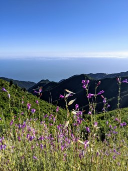 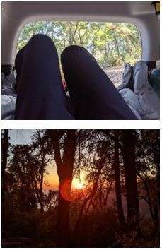 

--- 

## Inspiration

Placeholder for my brother

Placeholder for growing up in Alaska in nature

## Vanlife: Home is where you park it

<iframe width="560" height="315" src="https://www.youtube.com/embed/tN4WHTGWlHY" frameborder="0" allow="accelerometer; autoplay; clipboard-write; encrypted-media; gyroscope; picture-in-picture" allowfullscreen></iframe>

## The cost of vanlife: the conversion

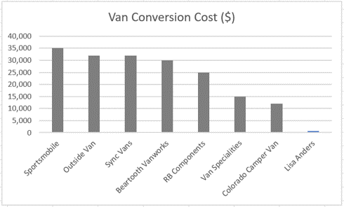

Assumptions: 

 - Cost does not include cost to purchase the van (which on the low end is 37,000 for a 2015 Sprinter)

Data: https://www.curbed.com/2018/9/24/17895974/camper-van-conversion-best-for-sale-custom-vanlife, https://www.thewaywardhome.com/van-conversion-companies/ 

## The cost of vanlife: the gas

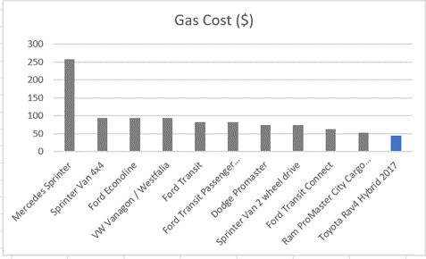

Assumptions: 

 - Gas cost: $2.5
 - Number of trips: 10
 - Distance of trip: 150 miles (75 miles one way to Anza Borrego)
 
In addition most vans don’t have AWD, meaning that reaching that magical dispersed camping spot might be a terrifying and expensive endeavor!

## The design process

Do you need a bathroom?

How big a bed do you need?

How will you be cooking?

Where will you get (and store) your water?

How much storage do you need?

What’s your budget?

What’s your comfort level with a jigsaw and drill?

## No going back: Removal of the backseats

<table style="width: 100%;">
    <colgroup>
       <col span="1" style="width: 15%;">
       <col span="1" style="width: 85%;">
    </colgroup>
<tr>
<td>
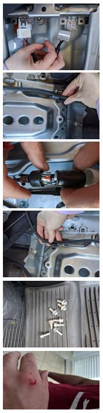 
</td>
<td>
This added an additional XX inches of room to the back of the car -> Making it possible to sit in the back instead of needing to crouch! 

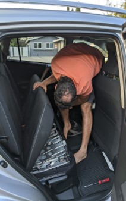 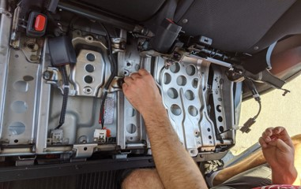

</td>
</tr>
</table>

## Battery platform: measure twice, cut once

Constructed mockup using cardboard to get the right fit (cars have tricky edges)

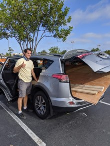 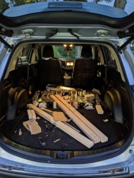 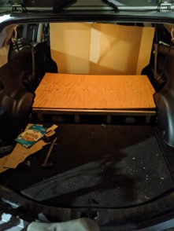

## Construction of the sleeping platform

V1: strong proof of concept without storage and using delicate cardboard as a lid
V2: Added feature to convert to a bench!

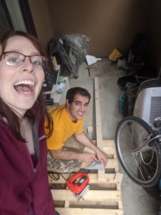

## Construction of the cooking table

Inspired by my brothers cooking table

 - Hooks onto hatch latch for secure connection
 - Indent for stove to securely hold in place
 - Added drawer for storage (and to make my brother jealous)

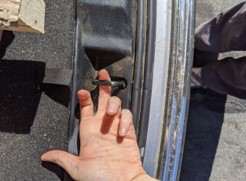 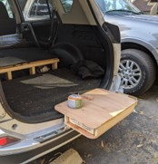 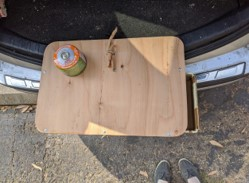

## Shelves with walls that aren’t square
 
Upcoming! 
 
 - Image of the before
 - Image of the after
 - Image loaded with stuff
 - Dimensions? 

## Adding the final frills

Upcoming!

 - Placeholders for lights
 - Body board storage
 - Gear storage 

## Resources 

 - www.reddit.com/r/priusdwellers/
 - https://vacayvans.com/worst-part-about-solo-vanlife-full-time-travel/

