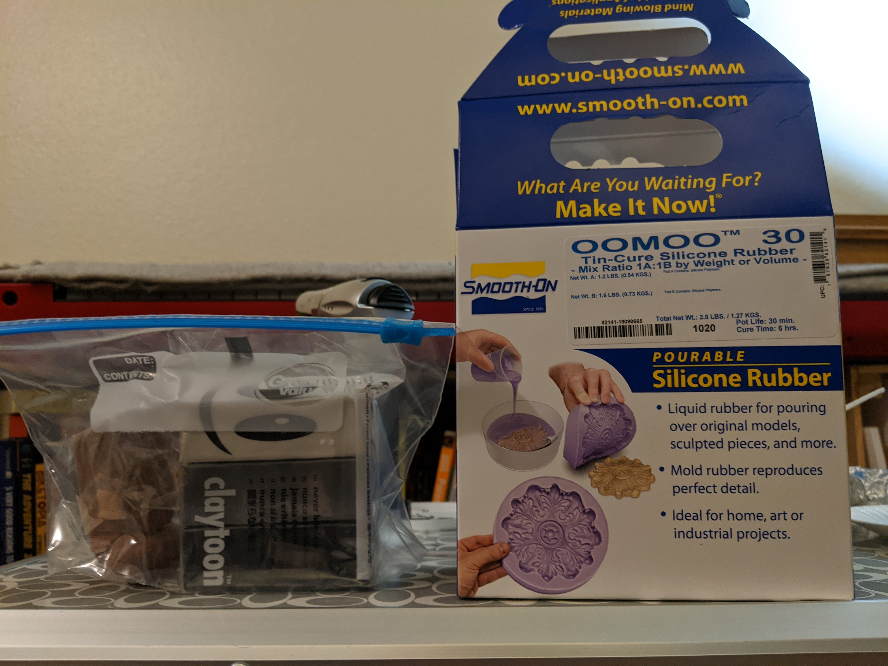
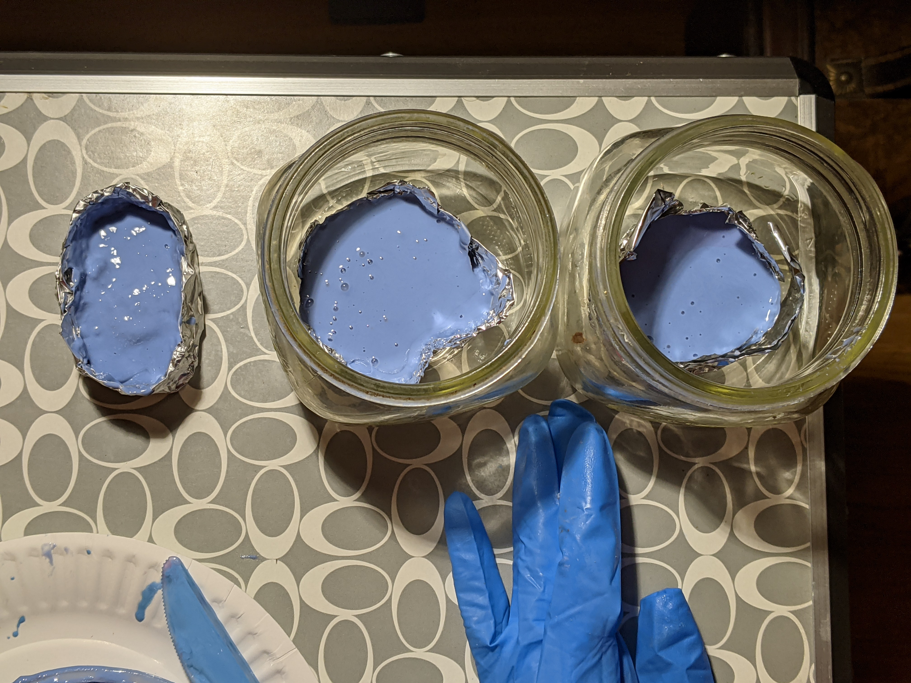

This page is under development, keep checking back as I learn more and have more useful information to share! 

---

## Experiments {.tabset}

### Mold Making: Attempt 1

The basics I've gathered for learning how to make molds are: 

 - Smooth-On OOMOO
 - Nitrile Gloves
 - Small hand torch (originally meant for creme brulee)
 - A Safety Pin
 - Plasticine Clay
 - Various small disposable cups, disposable plastic fork, measuring cup
 - Handful of my least favorite dice
 

Going to the crafts store the whole time I was thinking "this is going to go GREAT. How hard could it be? The videos are so calming, surely the whole process is straight up zen."

WRONG.

After learning how difficult it is to attach a pin into a D6 (I would describe it more as teetering perilously rather than actually mounted) we got to move onto lessons into practically what pot time is. While on thebox it may say pot time of 30 minutes in practice I had less than 20 minutes to get the silicone into the mold before it was hardening to the point of not flowing smoothly. 

Also had complete failure of the attempt at a vacuum chamber using my hand vaccuum, a small bell jar, and the valve on one of those clothes bags that let you vacuum the air out for better storage. No bubbles were successfully pulled out using this method, whether due to lack of a seal between the bell jar and the valve or if just wasn't a strong enough vacuum. 

The three mold attempts are sitting out to cure overnight before I'll begin the process of removing the die and trying out adding resin. I'm doubtful any of these turned out but what a wonderful way to spend a couple hours!

10/4/2020

---

## Resources

Here are some of the resources that helped me on my journey down this exciting and swearing-inducing path (in no particular order): 

 - https://www.evewynn.com/moldmaking 
 - http://www.hanleybrady.com/making-dice-part-1-molds/
 - https://www.instructables.com/Custom-Dice/
 - https://www.thingiverse.com/thing:3795542
 - https://www.youtube.com/watch?v=iRDte2j54F0
 - https://www.reddit.com/r/dice/comments/8zemqn/looking_to_resin_cast_my_own_dice/
 - https://www.youtube.com/watch?v=FQ1A7ZjTsx8

