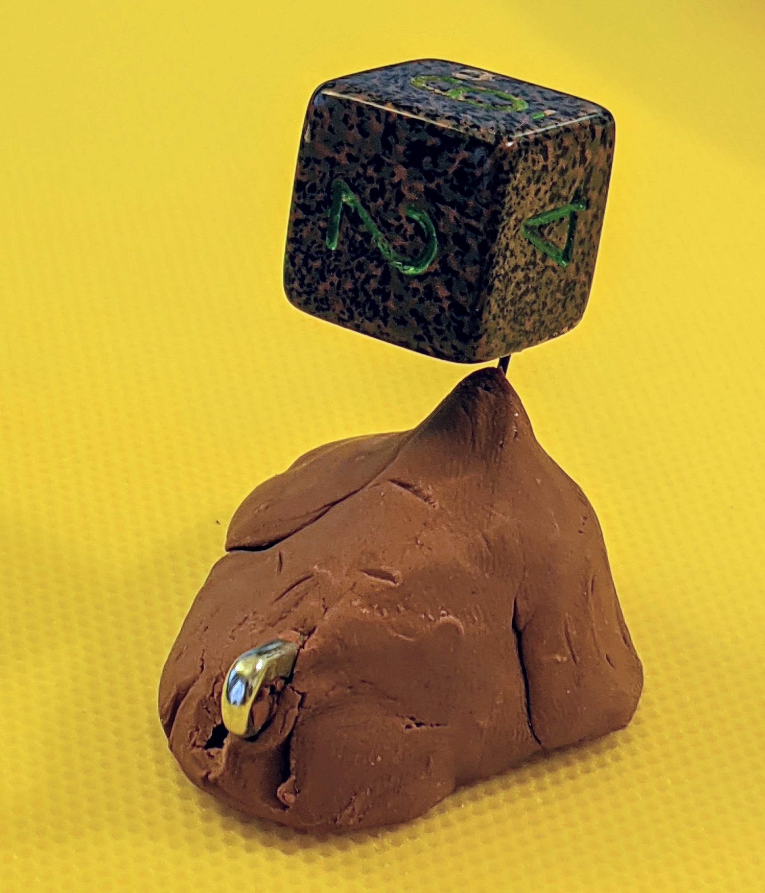
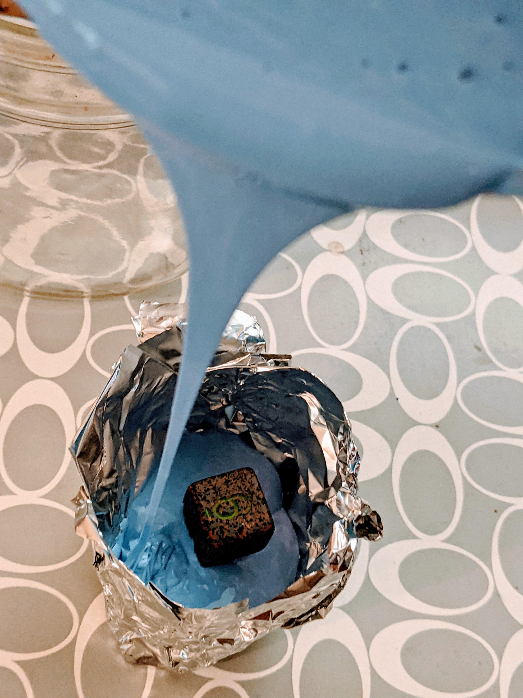
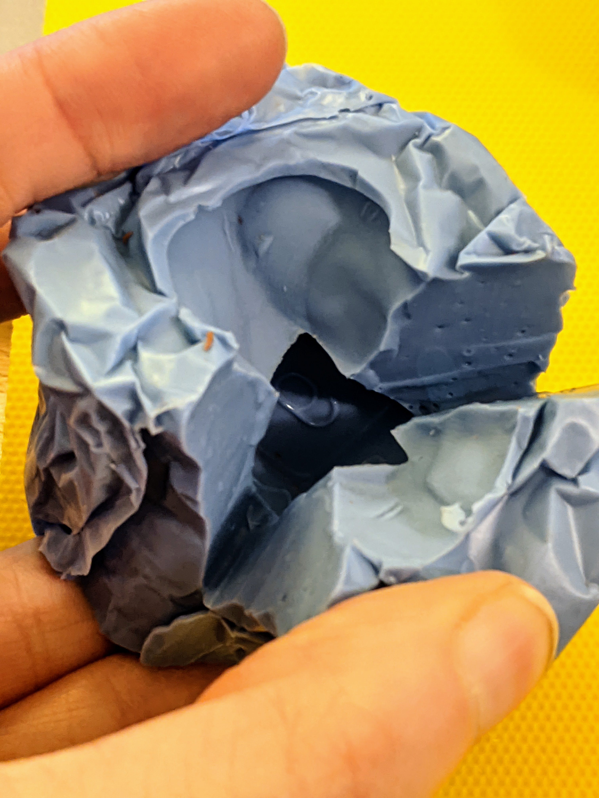
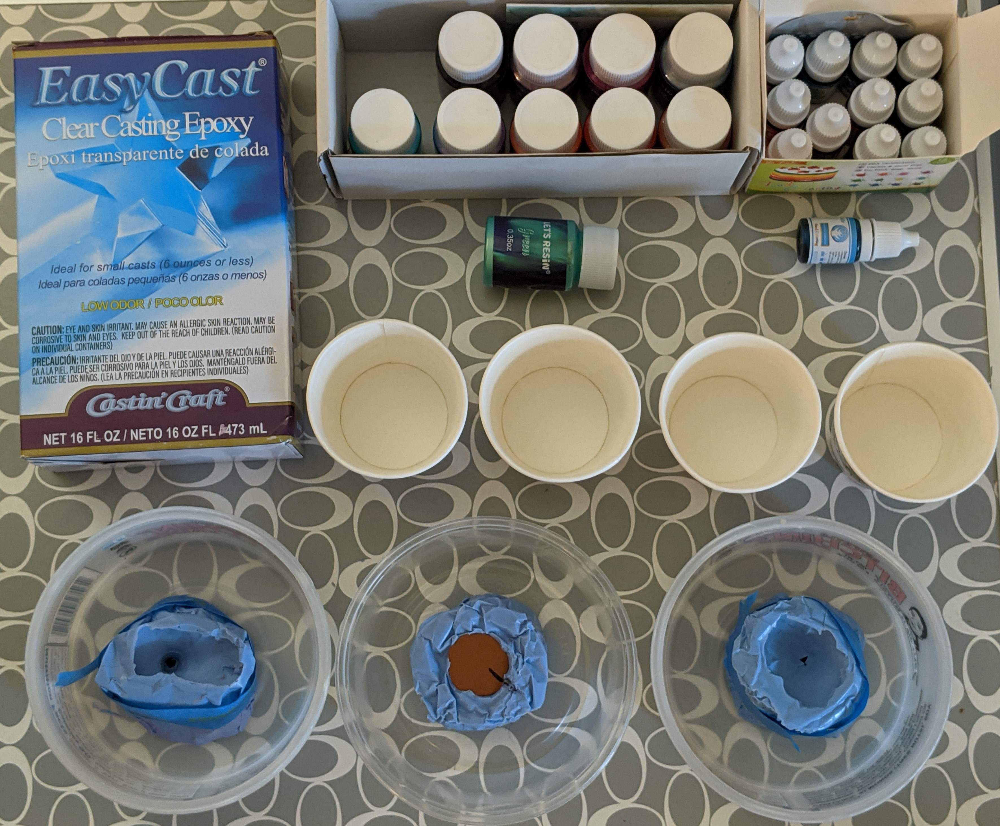
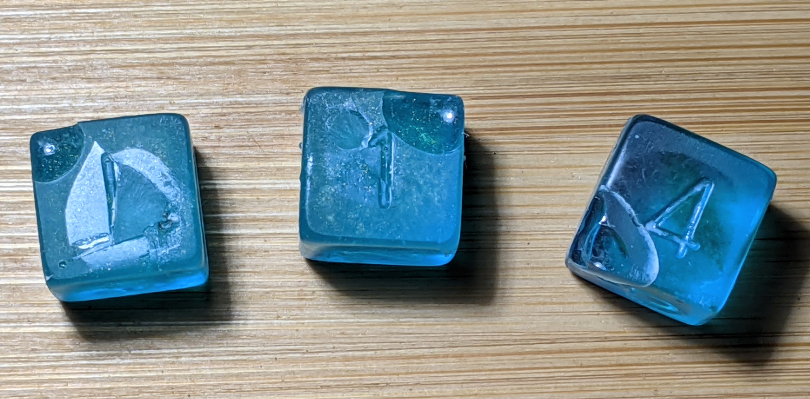

---

This page is under development, keep checking back as I learn more and have more useful information to share! 

---

## Experiments {.tabset}

### Silicone Mold

{#id .class width=20%}

Try 2 of creating the silicone mold. I was able to use the lessons from last time and create a mold with the sprue large enough to get a good amount in there while still having it be small enough that hopefully polishing won't be horrible. 

Interesting enough I think that the mixture is very sensitive to the quantities of each part. While I was very careful to match the volumes using my trusty 1/2 cup measuring spoon we can notice a distinct change in color. Despite this change in color it did successfully set and it doesn't feel different and will do nicely as a mold. 

END TEST

Try 2 of creating the silicone mold. I was able to use the lessons from last time and create a mold with the sprue large enough to get a good amount in there while still having it be small enough that hopefully polishing won't be horrible. 

Interesting enough I think that the mixture is very sensitive to the quantities of each part. While I was very careful to match the volumes using my trusty 1/2 cup measuring spoon we can notice a distinct change in color. Despite this change in color it did successfully set and it doesn't feel different and will do nicely as a mold. 

I'm a little concerned with my splits in the mold for removing the pieces. Hopefully it will seal up well enough that we won't have the resin leaking out or really large obvious lines. 

10/5-6/2020

---

The basics I've gathered for learning how to make molds are: 

 - Smooth-On OOMOO
 - Nitrile Gloves
 - Small hand torch (originally meant for creme brulee)
 - A Safety Pin
 - Plasticine Clay
 - Various small disposable cups, disposable plastic fork, measuring cup
 - Handful of my least favorite dice

Going to the crafts store the whole time I was thinking "this is going to go GREAT. How hard could it be? The videos are so calming, surely the whole process is straight up zen."

WRONG.

After learning how difficult it is to attach a pin into a D6 (I would describe it more as teetering perilously rather than actually mounted) we got to move onto lessons into practically what pot time is. While on thebox it may say pot time of 30 minutes in practice I had less than 20 minutes to get the silicone into the mold before it was hardening to the point of not flowing smoothly. 

Also had complete failure of the attempt at a vacuum chamber using my hand vaccuum, a small bell jar, and the valve on one of those clothes bags that let you vacuum the air out for better storage. No bubbles were successfully pulled out using this method, whether due to lack of a seal between the bell jar and the valve or if just wasn't a strong enough vacuum. 

The three mold attempts are sitting out to cure overnight before I'll begin the process of removing the die and trying out adding resin. I'm doubtful any of these turned out but what a wonderful way to spend a couple hours!

10/4/2020

---

### Pouring the Resin

Same recipe as before, still looks beautiful and we now have a matching set of 6!

10/8/2020

---

Wow this just turned out BEAUTIFUL. 

Recipe: 

 - 1 drop 'kiwi' food coloring 
 - Half of a handle full of green metallic mica powder
 - Blue flower

Thoroughly mix equal parts of resin for 2 minutes, transfer to second container and add coloring. Mix for an additional minute and use pipettes (two pipette method where one can fill while you use the other one) to fill each mold. Gently insert a flower once 3/4 full. Swish the containers by rotating to encourage air bubbles to exit from difficult places in the mold.  

10/7/2020

---

The ingredients for pouring the resin: 

 - Dried flowers
 - Food coloring
 - Mica powders
 - EasyCast resin
 - Dixie cups, pipettes, nitrile glove, facemask (not pictured)
 

 
This batch I decided to focus on blues. 

Recipe: 

 - 2 drops blue food coloring 
 - For 2 of the dice added the green mica powder

Since I layered it in with pure blue on bottom and the blue + mica powder on top it really developed a beautiful layering effect. 
 

10/6/2020

---

### Polishing

Very happy to report success with the "swish". Only 1 out of the three dice has a bubble in the corner disrupting the pattern (and this one is the hardest mold, with the highest point being higher than where the sprue intersects). 

10/9/2020

---

I've gathered my polishing components: namely various gtis of sandpaper and some car automotive buff. 

First step is trimming off the sprue. This was done using a pair of shears (I used wirecutters). The ends come off pretty explosively (think nail trimming but times a million) so definitely be careful which direction you are pointing the die and the sprue. 

All three have some kind of bubble where resin wasn't able to really fill the mold. Maybe doing a "swish" after filling will help next time for preventing this?

Here we have the before polishing with all the imperfections and remainder of the sprue. 

And here is our after with all the edges buffed out. Looking better, right? I think we can do better though because I did notice that the sides that came out looking good and shiny after being buffedstarted looking cloudy. 

Ideas for next time are to spend more time polishing on the finest grit. Maybe that will help get it super shiny? And spend longer polishing. It's about time for a netflix marathon anyway. 

10/8/2020

---

### Rolling the Dice

## Resources

Here are some of the resources that helped me on my journey down this exciting and swearing-inducing path (in no particular order): 

 - https://www.evewynn.com/moldmaking 
 - http://www.hanleybrady.com/making-dice-part-1-molds/
 - https://www.instructables.com/Custom-Dice/
 - https://www.thingiverse.com/thing:3795542
 - https://www.youtube.com/watch?v=iRDte2j54F0
 - https://www.reddit.com/r/dice/comments/8zemqn/looking_to_resin_cast_my_own_dice/
 - https://www.youtube.com/watch?v=FQ1A7ZjTsx8

